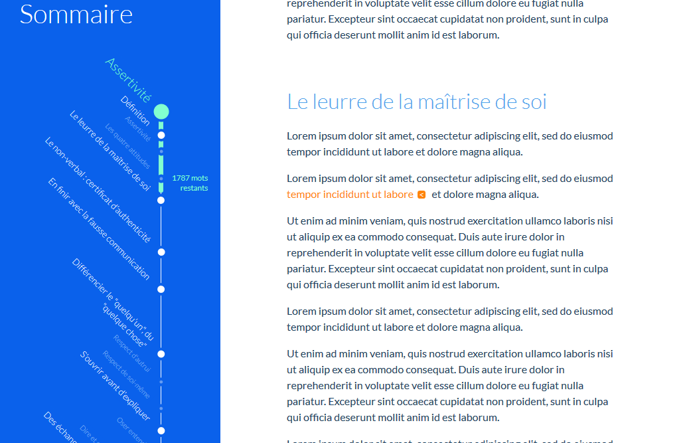

# outline.js

Ceci est un POC. Il a pour objectif de créer une table des matières dont les sections sont réparties sur une ligne proportionnellement à leur taille. Le but est de vérifier sa faisabilité, son utilisabilité et son utilité.

Dans cet exemple, le sommaire se présente sous forme de ligne de transport en commun.

## Démo

https://outlinejs.y-tournebise.com/

## Note à propos du code

J'ai écrit ce code il y a longtemps, et je me rend compte en le relisant aujourd'hui qu'il devrait être totalement réécris. Ne pas tenir compte de sa qualité douteuse ^^

## Screenshot

